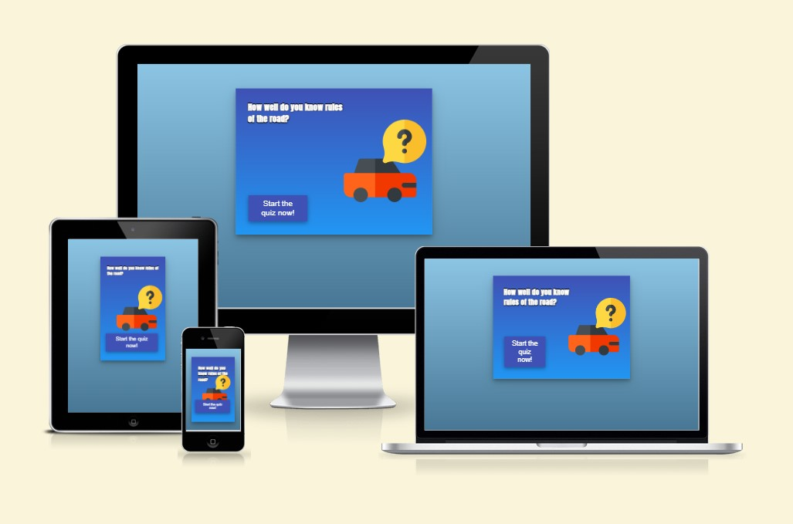
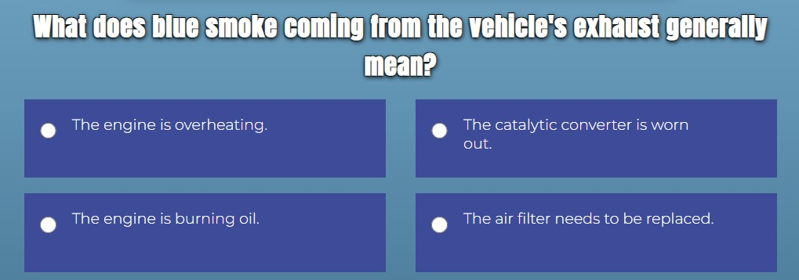
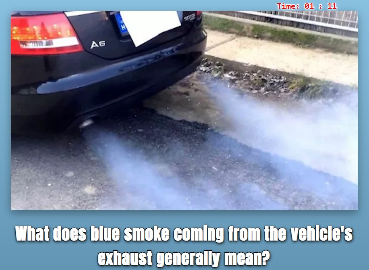
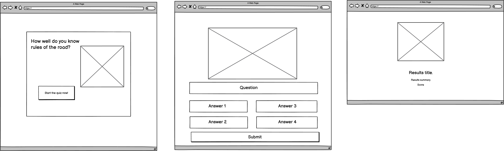
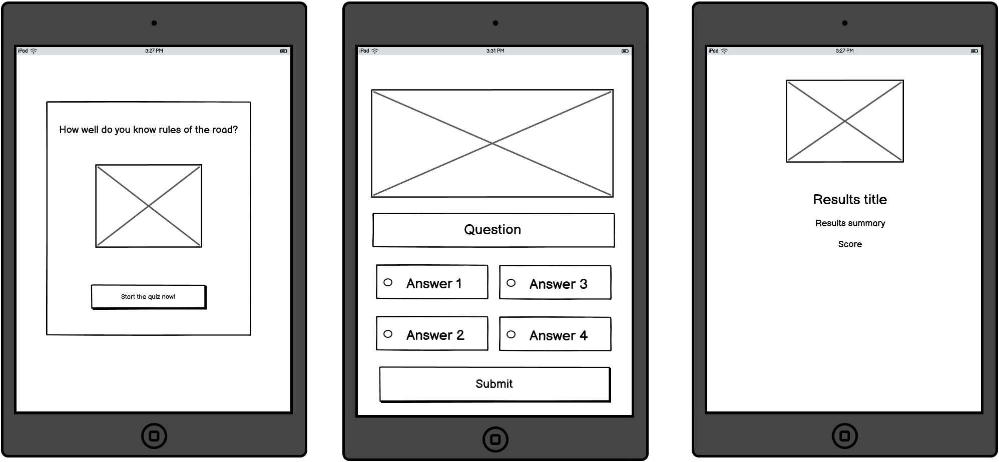
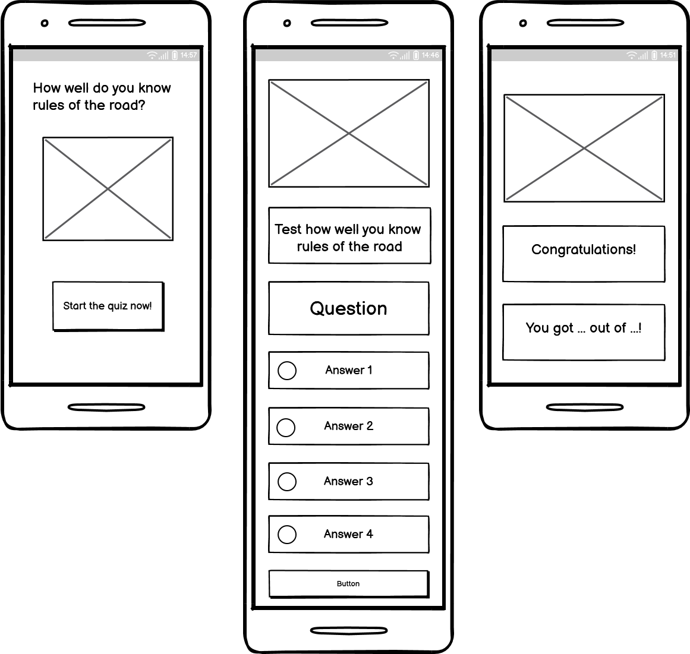
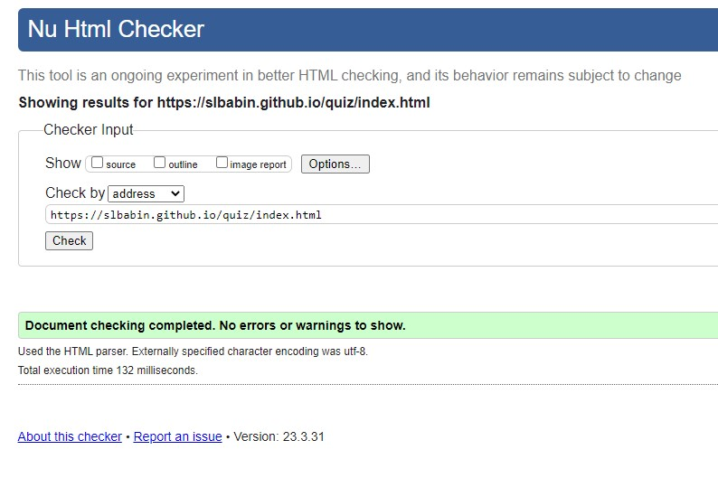
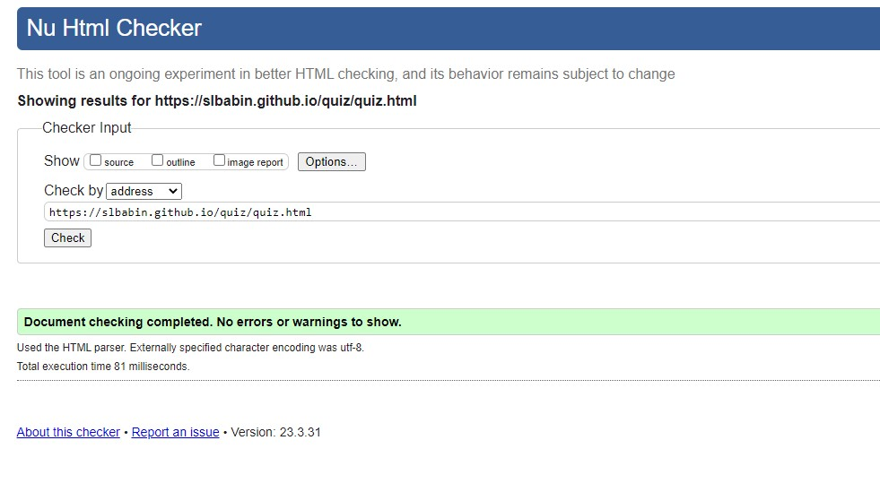

# Quiz info

This quiz is designed to test participants knowledge of traffic rules and regulations, ensuring that they have a solid understanding of the rules necessary for safe and responsible driving. Whether you're a new driver preparing for your license exam or an experienced driver looking to refresh your knowledge, this quiz provides a comprehensive set of multiple-choice questions to challenge and educate participants.

Link to the live site [here](https://slbabin.github.io/quiz/). 

## Features

- Multiple Choice Questions: The quiz consists of a series of multiple-choice questions covering various aspects of traffic rules. Each question presents you with several options, and you must select the correct answer that best corresponds to the given scenario or rule.

      

- A dynamically changed with each question image: Images help visually represent concepts or scenarios related to the quiz questions. They  enhance the clarity and understanding of the question by providing a visual context, making it easier for the user to interpret and answer accurately.

     

- Time tracking: After starting the quiz, the timer appears on the screen. The timer adds a sense of challenge and urgency to the quiz, encouraging participants to answer questions quickly and efficiently. It creates a more engaging and dynamic experience, keeping users focused and motivated throughout the quiz. 

     

- Score calculation: At the end of the quiz, a user presented with the score based on the number of answered correct answers out of the total pool of questions. 
The score serves as a motivator for participants to strive for a higher score with each attempt. It provides a target to beat and can encourage a sense of achievement when participants see improvement over time. 

     

- Spent time calculation: The time spent counter allows participants to reflect on the amount of time they took to complete the quiz. It provides a sense of self-awareness regarding their speed and efficiency in answering the questions. Participants can assess whether they took an appropriate amount of time or if they need to work on improving their time management skills.

     

## Design 

- The quiz consists of the landing page and the actual quiz page. A landing page sets the context and creats anticipation for the participants. 

- Wireframes
  
    

    
Desktop wireframes

    
    

    

    
Tablet wireframes

    
    

    

    
Mobile wireframes
    
    
    

__Colour Scheme__
    - Blue was chosen as the main color of the quiz because it is often associated with clarity, logic, and rational thinking. It is a color commonly used in educational settings due to its perceived intellectual qualities. By incorporating blue into the quiz's color scheme, it can create an atmosphere that promotes clear thinking and logical problem-solving, which are essential aspects of a quiz. 
    - The text color is white because is is often associated with cleanliness, simplicity, and minimalism. It creates a clean and uncluttered visual appearance, allowing the content to stand out.

__Typography__
    - The Montserrat font was chosen as the main font throughout the whole website due to its clean and attractive design. Sans Serif  was chosen as the fallback font. 
    - The Anton font was chosen for titles and headings. Anton is a bold and attention-grabbing font. It has thick letterforms with high contrast, which make it stand out on the page.  

## Testing and Validation
 The HTML of the quiz was validated using the W3C Markup Validation Service . All pages passed with no errors or warnings.
 - HTML validation
    

    
Index page HTML validation

    
    

    

    
Quiz page HTML validation

    
    

 - CSS validation

## Deployment
1. Log in to GitHub and locate the [GitHub Repository](https://github.com/)
2. On the Repository page, click on the "Settings" button.
3. Scroll down to the Pages tab on the left side.
4. Under Branches select Main and click Save.
5. The page will refresh and the link to the site will appear [https://slbabin.github.io/quiz/index.html](https://slbabin.github.io/quiz/index.html)

## Technologies Used
Languages Used
- [HTML5](https://en.wikipedia.org/wiki/HTML5)
- [CSS3](https://en.wikipedia.org/wiki/Cascading_Style_Sheets)
- [JavaScript](https://en.wikipedia.org/wiki/JavaScript)

Programs Used
 - [GitHub:](https://github.com/) Used for version control and to store the projects code after being pushed from GitPod or Codeanywhere.
  - [Codeanywhere:](https://codeanywhere.com/) Alternative cloud IDE to GitPod
  - [Photopea:](https://www.photopea.com/) Online photo editor. Used for editing images.
  - [Balsamiq:](https://balsamiq.com/wireframes/) Was used to create the wireframes.
  - [Google fonts:](https://fonts.google.com/) Used to import the 'Monserat' and Anto fonts into the style.css file which is used on all pages throughout the project.